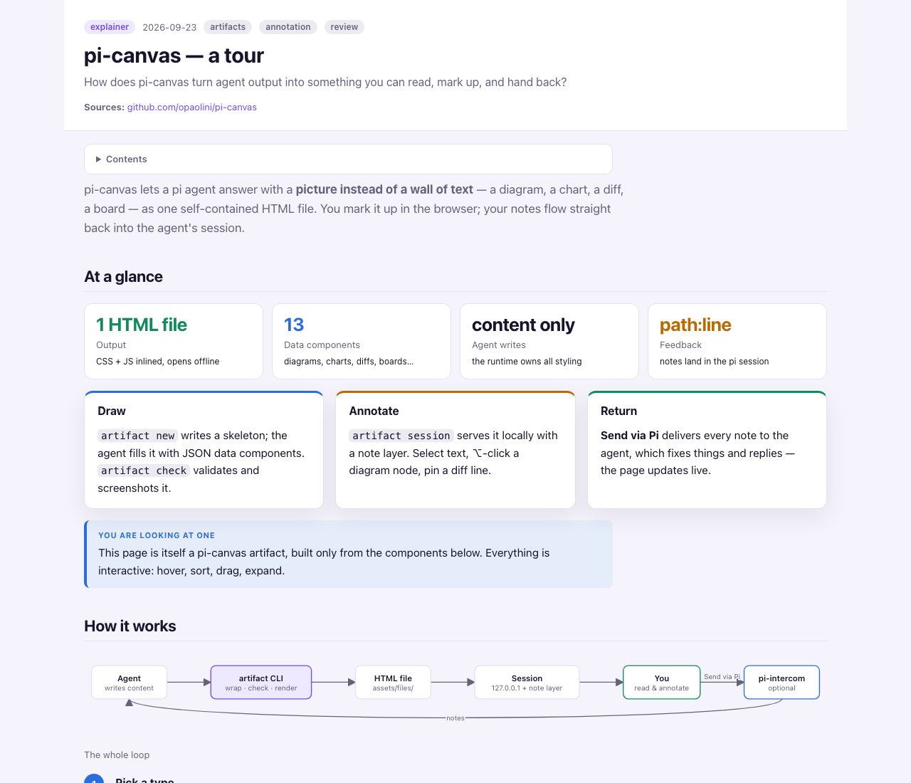

# pi-canvas

A [pi](https://pi.dev) package where agents draw self-contained HTML artifacts and you annotate
them in the browser; your notes go back to the agent's pi session.

- **`artifact` CLI.** Explainers, plans, reports, decks, dashboards, boards and code reviews, built from
  a fixed component set: flow and sequence diagrams, bars, line charts, timelines, diffs, trees, matrices,
  KPIs and boards. Each artifact is one HTML file with no network dependencies. The agent writes only
  the content; the runtime (CSS/JS) is re-injectable, so every artifact can pick up upgrades.
- **Annotation sessions.** Select text or ⌥-click an element → question / note / change / approve
  → **Send via Pi** delivers the notes to the agent through
  [pi-intercom](https://www.npmjs.com/package/pi-intercom). They can also be copied as a prompt, Markdown or JSON.
- **Local pre-PR review.** `artifact review` renders your branch diff (committed, uncommitted and
  untracked changes vs. the merge base). Notes on diff lines arrive as `path:line`. The agent fixes the
  code and refreshes the diff, and you iterate until you approve.
- **Review gate.** A `review_gate` tool, plus a `reviewGate()` function for
  [pi-extensible-workflows](https://github.com/vekexasia/pi-extensible-workflows) when that is installed,
  that shows an artifact and blocks until you approve or request changes, with inline notes.

## Example

[`examples/showcase.html`](examples/showcase.html) is a tour of how pi-canvas works, built only from its
own components: flow and sequence diagrams, a diff with review notes, compare, board, charts, timeline,
tree, matrix and annotated code. Download it and open it in a browser, or run
`artifact session examples/showcase.html` to try annotating.



## Install

```sh
pi install git:github.com/opaolini/pi-canvas          # user scope
pi install -l git:github.com/opaolini/pi-canvas       # project scope (.pi/settings.json)
```

Requirements:
- [Bun](https://bun.sh) for the `artifact` CLI.
- Google Chrome for `artifact check` screenshots (optional).
- macOS `open` to launch the browser.

Optional: pi-intercom for **Send via Pi**, and pi-extensible-workflows for `reviewGate()`.

Skills `html-artifact` and `local-review` teach the agent the loop; just ask for an explainer,
a plan or "a local review of this branch before the PR".

## CLI

```sh
artifact types | components
artifact new <type> <slug> [--title T] [--subject a,b] [--sources url,…] [--question Q] [--theme light|dark]
artifact check <slug>… | --all          # static checks + headless Chrome render
artifact list | rebuild <slug>… | --all | open <slug>
artifact review <slug> [--repo PATH] [--base REF]       # local pre-PR review (re-run to refresh the diff)
artifact session <slug> [--detach] [--url] [--to <pi-session>] | --stop <slug>
artifact notes <slug> [--format markdown|json|prompt] | reply <slug> <id> "text" | resolve <slug> <id>
```

Artifacts are written to `<root>/assets/files/`, where root is:
1. `$ARTIFACT_ROOT`, if set;
2. otherwise the nearest ancestor that has `assets/files/`;
3. otherwise the git repository root;
4. otherwise the current directory.

Notes live next to each artifact as `<file>.notes.json`. The full contract is in
[`artifacts/SPEC.md`](artifacts/SPEC.md) and the component reference in
[`artifacts/COMPONENTS.md`](artifacts/COMPONENTS.md).

## Development

```sh
bun test artifacts                 # CLI, notes, sessions, review (no Chrome needed)
node --test test/*.test.mjs        # loads the package through pi's resource loader, offline
pi install -l /path/to/pi-canvas   # live-edit install in a project
```

MIT
